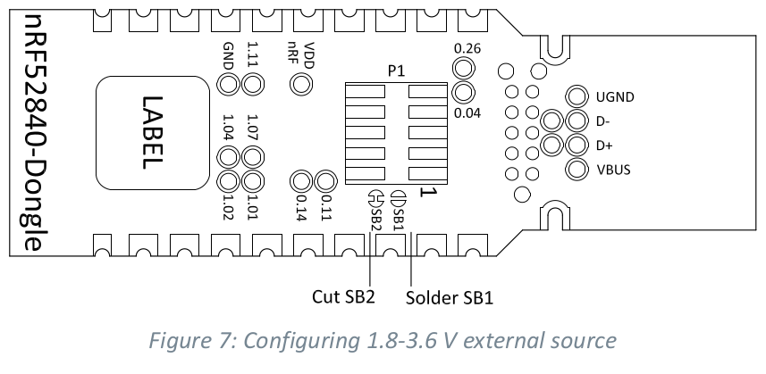
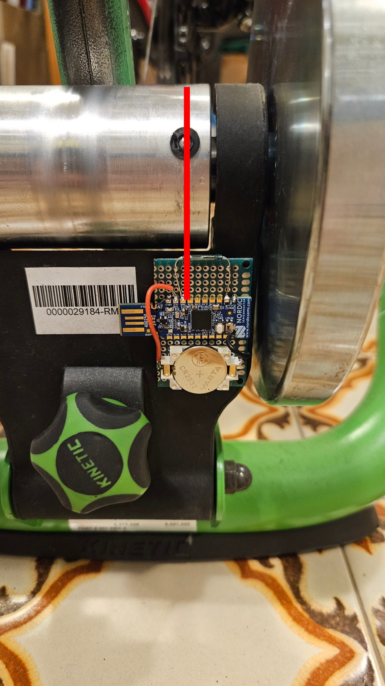

# Bike trainer sensor
This is an open source sensor for bike trainers, such as Tacx Boost, Kurt Kinetc Road, Elite Qubo Fluid etc. Purpose of this project is to be able to replace the sensor on your trainer if it stops working, or if the company shuts down the trainer app. This happened to me with Kurt Kinetec, and since they have propriarety BLE service, the sensor is useless.

This sensor uses Bluetooth LE protocol with Fitness Machine Service (FTMS), which is standard service and compatible with all trainer apps, like MyWhoosh, Zwift, TrainerRoad and others.

The uploaded firmware is for Kinetic Road Trainer T2700. FTMS provides only data for the Indoor bike -> Instantaneous power.

# How to use this?
## Prepare the nRF52840 dongle for FOTA

1. From Firmware folder check if `mcuboot.hex` is pristine, by checking the hash function of the file. All the info is in `mcuboot.hex.info` file.
2. Insert nRF52840 dongle into the USB port on your PC and click reset button on the dongle to get into nRF5 bootloader (red LED should be pulsing).
3. With [nRF Connect for Desktop](https://www.nordicsemi.com/Products/Development-tools/nrf-connect-for-desktop/download) write `mcuboot.hex` to the dongle.
4. Next, unplug the dongle, hold down white button and plug the dongle back to the USB port. Green LED should be on, showing the program is now waiting in the MCUboot. Write `bike_trainer-<commit number>.signed.bin` to the dongle with [AuTerm](https://github.com/thedjnK/AuTerm).
5. Check if everything is working with the nRF Connect Android or iOS app.

## Prepare the nrf52840 dongle for battery power supply

1. Before doing this, make sure you can do FOTA. Once the board is configued for battery power, you need battery power to transfer data over the USB port. *Power will not come from the USB port.*
2. Cut SB2 and solder SB1, like it's shown in the nRF52840 dongle documentation.

3. Connect 1.8–3.6 V (max50 mA) source through the VDD OUT connection point.
4. Connect reed switch to the P1.10. You can also connect to any onther pin, but you have to reconfigure pins in the devicetree and recompile the project.

## Installation

One you have programmed the firmware, made sure you can do FOTA, and prepared the dongle for battery power supply, it's time to connect everything and install the sensor.

1. PCB is currently not available yet. Please see the picture how I connected everything on the protoboard.

2. You can put everything in the box, or 3D print a box.
3. When installing, make sure the magnet is not on the center of the reed switch. I recommend you put it to the one side.
4. Listen to the reed switch if it's triggered or not.
5. [Available in the future]: in the nRF Connect app, enable LED to see if the reed switch is triggered or not. 

# Firmware development

## SDK Installation

[Video instructions](https://youtube.com/playlist?list=PLx_tBuQ_KSqEt7NK-H7Lu78lT2OijwIMl)

1. Install nRF Command Line Tools ([Download](https://bit.ly/2YgBGC5))
2. Install Visual Studio Code ([Download](https://code.visualstudio.com/Download))
3. **Make sure to install SDK version 2.9.0!**

## Development setup

1. After cloning git repository, open `Firmware.code-workspace` with VS Code.
2. Go to nRF Connect and create *build configuration*. Under APPLICATIONS add build the configuration.
   - Board: `nrf52840dk_nrf52840` or other board.
   - Build directory name: `release` or `debug`
   - Select *Extra Kconfig fragmetns*: `debug-overlay.conf` or `release-overlay.conf`

For API and how to, check [Nordic's developer website](https://docs.nordicsemi.com/bundle/ncs-2.9.0/page/nrf/index.html).